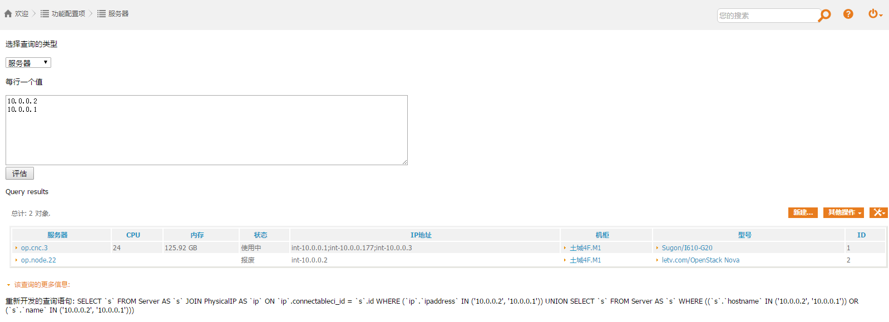
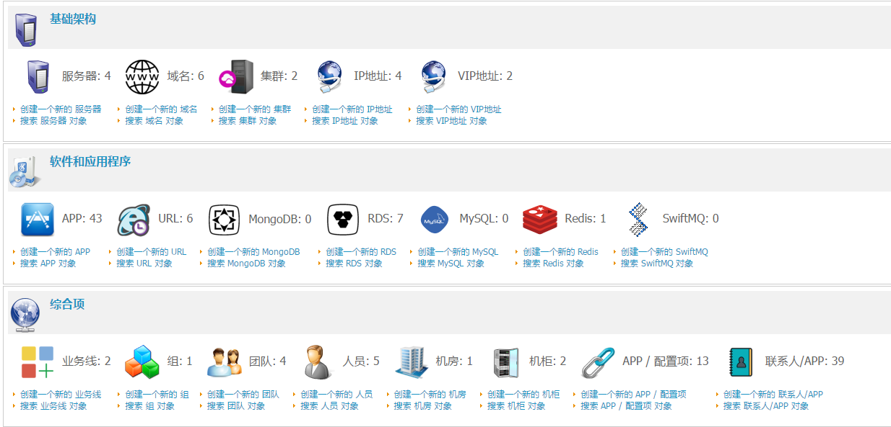
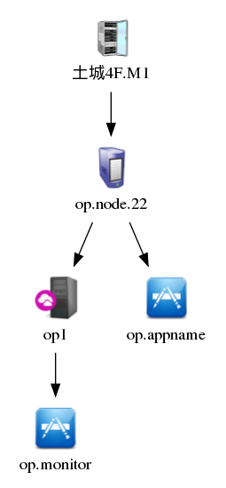

# itop-extensions

## add-user-action-menu
右上角新增编辑用户资料按钮


## api-client
iTop rest api的客户端

## authent-ucenter
UCenter验证用户。未完成

## combodo-autoclose-ticket
iTop官方插件, 自动关闭工单

## custom-mod
主要修改工单的生命周期
- 拒绝状态的工单可以被关闭
- 指派状态的工单可以被拒绝
- 删除新portal的location_id

## custom-pages
提供一个批量查询页面



## email-reply
iTop官方插件，工单更新时可以邮件通知

## itop-object-copier
iTop官方插件，克隆对象

## itop-request-template & templates-base
iTop官方插件定制版
新增如下功能
- 排班，用户请求工单自动指派
- Incident自动指派
- UserRequest工单申请的资源自动录入CMDB


## le-config-mgmt
定制版数据模型



## portal-announcement
第三方插件 https://github.com/itop-itsm-ru/portal-announcement ，用于在legency portal展示公告信息，做了微小改动以支持富文本

## precanned-replies & precanned-replies-pro
iTop官方插件，预定义回复

## rest-ext
rest扩展。新增接口 ext/get_related，扩展了core/get_related接口，支持

- objects输出指定类型的类
- relations输出指定类型的类或者隐藏指定类型的类
- objects输出的类指定输出fields
- relations可以指定输出的深度
- relations可以指定输出关联的方向(上游，下游，或者全部)

```
/**
 * Implementation of custom REST services (get_related: support custom show_fields)
 *  
 *  custom api: ext/get_related
 *  $class: mandatory, class name
 *  $key: mandatory, search object
 *  $relation: impacts or depends on
 *  $optional: optional, an array with keys:filter,show_relations,output_fields,depth,direction,redundancy
 *      - filter: array of class name, like array("Person","Server"). only show objects in filter array
 *      - show_relations: array of class name, like array("Person", "Server"). only show relations about class in the array
 *      - hide_relations: array of class name, like array("Person", "Server"). hide relation with class in the array 
 *      - output_fields: array like array("classname"=>"fields")
 *      - depth: relation depth
 *      - direction: impacts direction(up,down or both)
 *      - redundancy: true of false
	public function extRelated($class, $query, $relation="impacts", $optional=array())
	{
		$mandatory = array('class'=>$class, 'key'=>$query, 'relation'=>$relation);
		$param = array_merge($mandatory, $optional);
		return $this->operation('ext/get_related', $param);
	}
	
*/
```

https://github.com/annProg/cmdbApi 此项目提供了一个ext/get_related客户端，并且使用dot画出relations的图形，例如使用以下参数调用

```
public.php?type=ip&value=10.0.0.2&filter=Server&show=Server,Cluster,Rack,ApplicationSolution&direction=both&depth=2
```

查询`IP`为`10.0.0.2`的服务器的关联关系，并且objects只显示`Server`类，relations类显示`Server,Cluster,Rack,ApplicationSolution&direction`,并且同时显示此服务器的上下游关联，关联深度只显示2级，返回类似如下结果

```
{
  "relations": {
    "Server::2::op.node.22": [
      {
        "key": "Cluster::3::op1"
      },
      {
        "key": "ApplicationSolution::54::op.appname"
      }
    ],
    "Cluster::3::op1": [
      {
        "key": "ApplicationSolution::53::op.monitor"
      }
    ],
    "Rack::11::土城4F.M1": [
      {
        "key": "Server::2::op.node.22"
      }
    ]
  },
  "objects": {
    "Server::2": {
      "code": 0,
      "message": "",
      "class": "Server",
      "key": "2",
      "fields": {
        "id": "2",
        "friendlyname": "op.node.22"
      }
    }
  },
  "code": 0,
  "message": "Scope: 1; Related objects: Server= 1",
  "imgurl": "http://cmdb.cn/chart/api.php?cht=gv:dot&chl=digraph+G..."
}
```

图片显示如下



## zh-language
中文翻译
