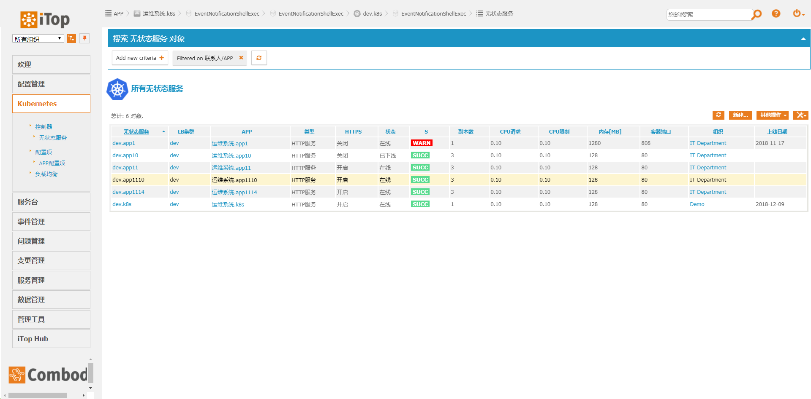
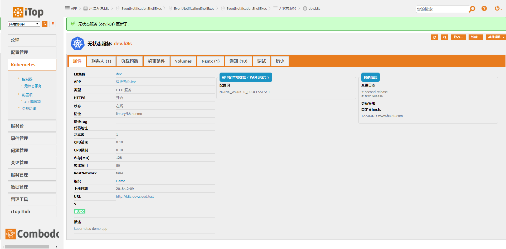
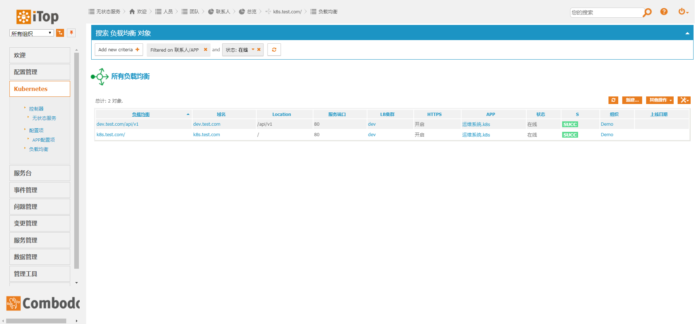
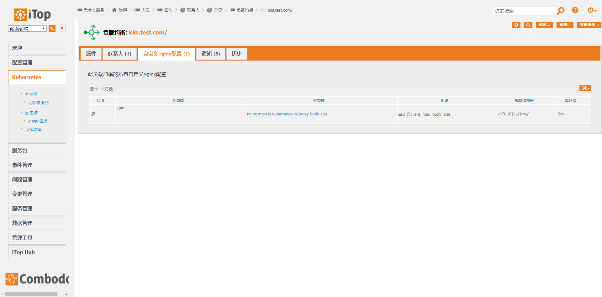
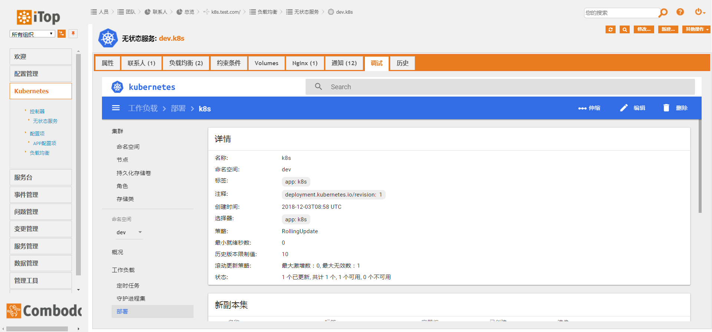

# Disclaimer

Chinese to English translation from Google translate (Schirrms)

# kubernetes
Using the complete `CMDB` function of `iTop` to manage `Kubernetes` objects, compared with `yaml` to define `Kubernetes` objects, it has the following characteristics
- Users only need to have basic docker container experience to use kubernetes, no need to learn kubernetes
- Resource uniqueness verification to ensure that app names, domain names, etc. will not conflict
- Use the lnk type of `iTop` to intuitively implement nginx configuration, volume mounting, affinity and other functions, users can directly check
- Use `lifecycle` to realize business update, offline and other operations. And it naturally supports batch operations. It is suitable for quickly launching a large number of services in batches in disaster recovery scenarios
- Permission control, users can only deploy `APP` related resources under their own name, and can only see the `secret` content of `APP` under their own name
- Embed kubernetes dashboard for user debugging

## preview
Deployment list 


Deployment Details Page 


Ingress list


Customize the nginx configuration page 


Embedded dashboard


## working principle
When the iTop object is created or deleted, the action execution script is triggered, and the Kubernetes API is called in the script to apply the update in the iTop

Triggers need to install the plugin annProg/itop-extensions/knowitop-trigger-on-update

Custom actions need to install the plugin annProg/itop-extensions/action-shell-exec

## Trigger configuration

TriggerOnCreate
````
"description","category","target class","filter"
"Kubernetes object creation","trigger (on object creation)","Kubernetes","SELECT Kubernetes"
````

TriggerOnObjectUpdate
````
"Description","Category","Target Class","Tracked attributes","Filter"
"Kubernetes object update","Trigger on object update","Kubernetes","","SELECT Kubernetes"
````

Both triggers link the following actions:

````
"Name","Category","Name","Description","Status","Path","Parameters"
"Kubernetes","Script execution","Kubernetes","Kubernetes object operations","In production","/home/wwwroot/default/cmdb/cmdbApi/actions/demo.sh","SCRIPT_NAME=kubernetes.php\ nID=$this->id$"
````

Action script see  https://github.com/annProg/cmdbApi/tree/master/actions

